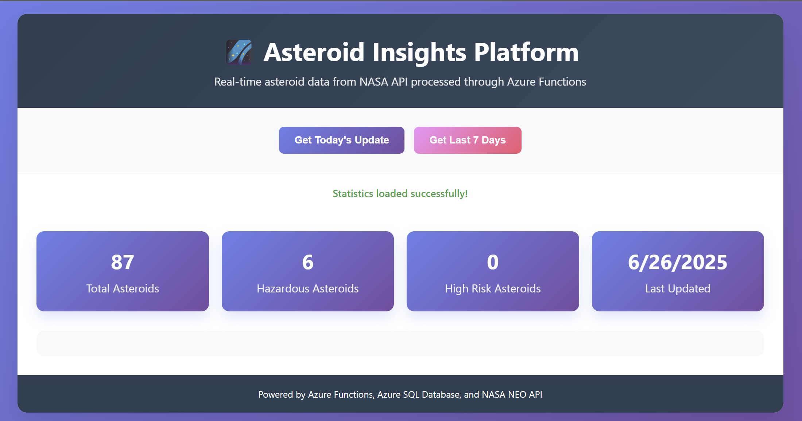

# Asteroid Insights Platform



A cloud-based platform that ingests real-time asteroid data from the NASA API, processes it using Azure Functions, and stores results in Azure SQL Database. Includes a web dashboard for visualizing asteroid statistics.

## Features
- Fetches asteroid data from NASA NEO API
- Automated ETL with Azure Functions
- Stores raw and processed data in Azure SQL Database
- Dashboard for real-time asteroid insights
- CI/CD with Azure DevOps

## Quick Start

1. **Clone the repository**
   ```bash
   git clone <repo-url>
   cd astroid-insights-platform
   ```
2. **Set up environment variables** (see `.env.example` or below):
   - `AZURE_STORAGE_CONNECTION_STRING`
   - `AZURE_SQL_CONNECTION_STRING`
   - `NASA_API_KEY`
3. **Install dependencies**
   ```bash
   pip install -r requirements.txt
   ```
4. **Run the ETL pipeline locally**
   ```bash
   python src/asteroid_processor.py
   ```
5. **Deploy to Azure**
   - Use Azure DevOps pipeline (`azure-pipelines.yml`) for automated deployment.

## Project Structure
```
astroid-insights-platform/
├── assets/
│   └── asteroid-dashboard.png
├── src/
├── sql/
├── tests/
├── azure-pipelines.yml
└── README.md
```

## Main Azure Services Used
- **Azure Functions**: Serverless ETL and data processing
- **Azure SQL Database**: Stores asteroid data and insights
- **Azure Blob Storage**: (Optional) Stores raw NASA API responses
- **Azure DevOps**: CI/CD pipeline

## Environment Variables
```
AZURE_STORAGE_CONNECTION_STRING=
AZURE_SQL_CONNECTION_STRING=
NASA_API_KEY=
```

## License
This project uses data from the NASA NEO API and is for demonstration purposes only. 